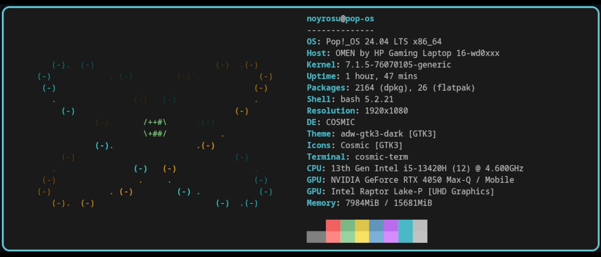
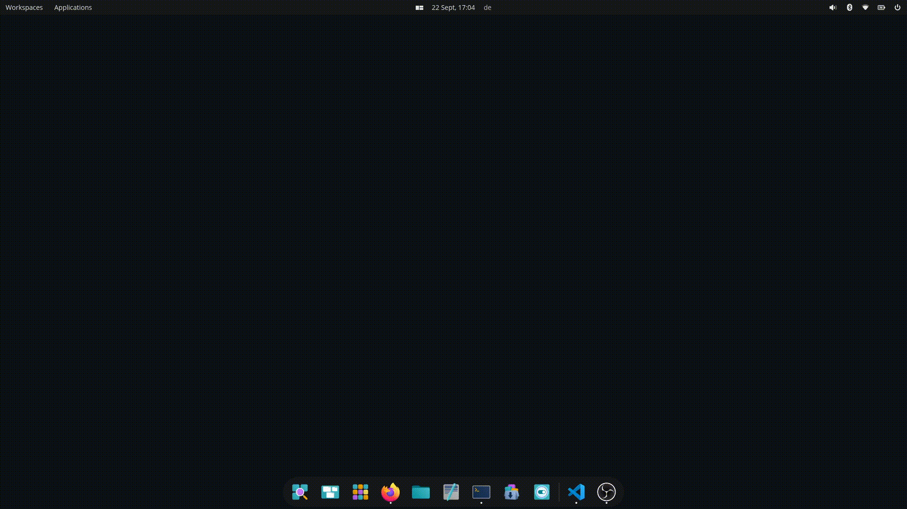
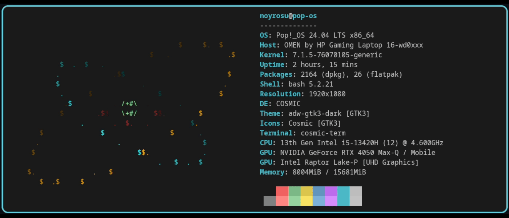
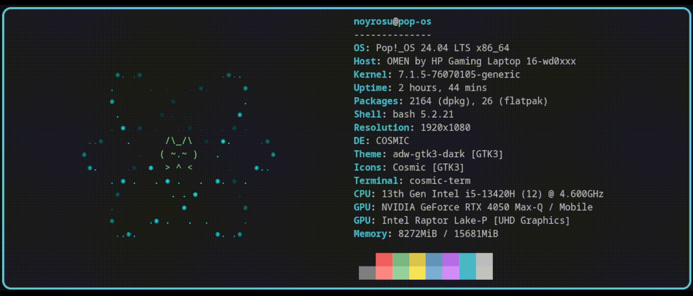

# Animated Atom ASCII in Terminal
A small animated 3D-inspired atom visualization for the terminal.
Built with Python using ANSI terminal rendering, simple 3D orbit projection,
depth-based coloring, and animated electron shells.



## Features

- Animated electron orbits
- Multiple orbital planes
- Depth-based shading
- Animated nucleus
- Dynamic terminal resizing
- System information displayed alongside the animation
- Configurable orbit parameters
- Example atomic configurations




## Examples




## How it works

The orbit is represented as a circle in 3D space. The circle can be tilted and rotated before being projected onto the terminal's
2D character grid.

Electron positions are calculated from their angular velocity:
    angle = initial_angle + time * speed

The depth of each point is then used to determine its brightness.

## Project structure

```txt
    terminal-startup/
    ├── src/
    │   ├── __main__.py
    │   ├── canvas.py
    │   ├── colors.py
    │   ├── config.py
    │   ├── examples.py
    │   ├── orbit.py
    │   └── system_info.py
    ├── LICENSE
    └── README.md
```

## Requirements

- Python 3
- A terminal with ANSI escape sequence support
- Neofetch

## Customization

Orbit appearance can be changed through the configuration:

- radius
- inclination
- rotation
- electron count
- angular speed
- color
- number of path points
- depth-shading levels

## Why I built this

This started as a small terminal animation experiment and became a way to
learn more about terminal rendering, coordinate transformations, animation,
and eventually performance optimization.

## License

MIT-0 License
