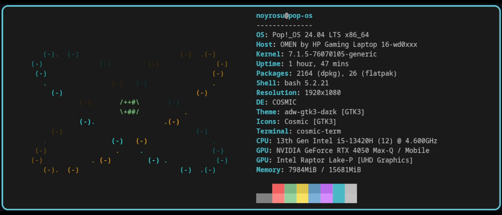
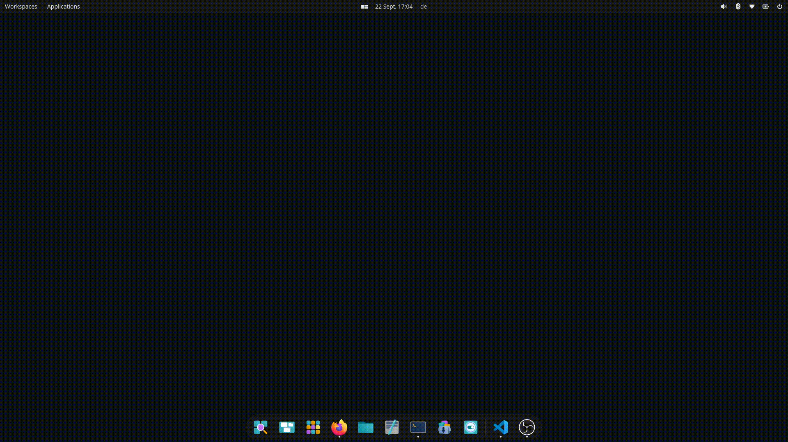
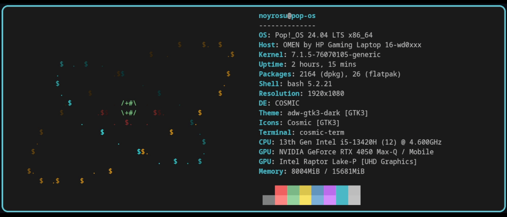
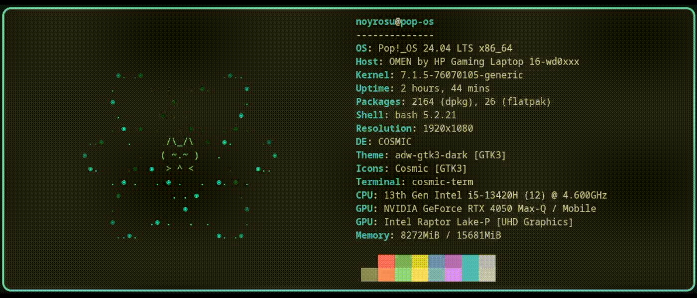
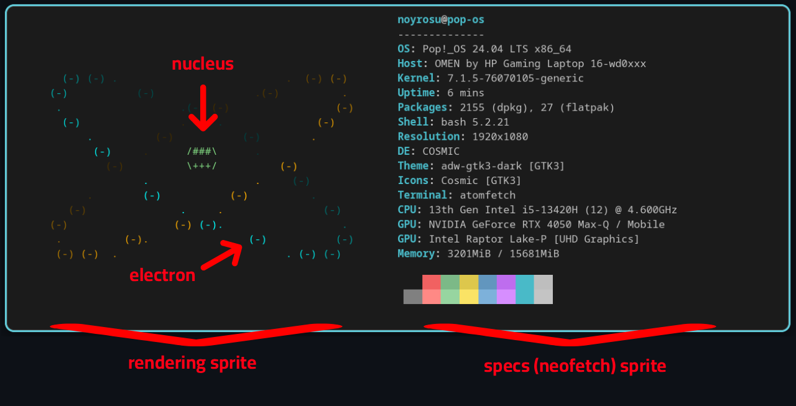

# atomfetch
A small animated 3D-inspired atom visualization for the terminal. Built with Python using ANSI terminal rendering, simple 3D orbit projection, depth-based coloring, and animated electron shells.



## Features

- Animated electron orbits
- Multiple orbital planes
- Depth-based shading
- Animated nucleus
- Dynamic terminal resizing
- System information displayed alongside the animation
- Configurable orbit parameters
- Example atomic configurations




## Examples




## How it works

The orbit is represented as a circle in 3D space. The circle can be tilted and rotated before being projected onto the terminal's 2D character grid.



The animation is built from three main steps:

1. Define circular orbits in 3D.
2. Transform and rotate the orbital planes.
3. Project the resulting geometry onto the terminal's 2D character grid.

#### 1. Parametric orbit

Each electron orbit starts as a circle of radius $R$, parameterized by an angle $\theta$:

$$
x = R\cos\theta,
\qquad
y = R\sin\theta,
\qquad
z = 0.
$$

#### 2. Tilting the orbital plane

The orbit is then tilted by an inclination angle $i$. This is equivalent to rotating the circle around the $x$-axis:

$$
x' = R\cos\theta
$$

$$
y' = R\sin\theta\cos i
$$

$$
z' = R\sin\theta\sin i.
$$

The $z'$ coordinate is not directly displayed, it contains the depth information needed to determine which parts of the orbit are closer to or farther from the viewer.

- $i=0$: the orbit is flat.
- $i=\frac{\pi}{2}$: the orbit is viewed edge-on.

#### 3. Rotating the orbital plane

The tilted orbit can then be rotated around the viewing axis by an angle $\phi$:

$$
x_s = x'\cos\phi-y'\sin\phi
$$

$$
y_s = x'\sin\phi+y'\cos\phi.
$$

The resulting ($\vec{p_s} = (x_s,y_s)$ coordinates are the 2D screen coordinates before they are mapped to terminal cells. The continuous screen coordinates are converted to discrete terminal-cell coordinates:

$$
\operatorname{round}(\vec{p}_c + \vec{p}_s)
$$

where $\vec{p}_c = (x_c,y_c)$ is the center of the terminal canvas. The resulting points are drawn as ASCII/Unicode characters with ANSI true-color shading.

## Project structure

```txt
terminal-startup/
├── src/
│   ├── __main__.py       
│   ├── canvas.py         # terminal canvas and rendering
│   ├── colors.py         # color and shading utilities
│   ├── config.py         # animation and display configuration
│   ├── examples.py       # examples animations / demonstrations
│   ├── orbit.py          # orbital geometry and electron motion
│   └── system_info.py    # system information collection
├── LICENSE               
└── README.md             
```

## Requirements

- Python 3
- A terminal with ANSI escape sequence support
- Neofetch

## Installation

Clone the repo, run the installation, and simply run `atomfetch`:

```bash
git clone https://github.com/Younes-Toumi/atomfetch.git
cd atomfetch
./install.sh
atomfetch
```

## Support
Currently supports features:

```bash
noyrosu@pop-os:~$ atomfetch --help
Atomfetch - animated terminal atom

Usage:
  atomfetch                    Start Atomfetch
  atomfetch --enable-startup   Enable startup animation
  atomfetch --disable-startup  Disable startup animation
  atomfetch --help             Show this help
```

## Why I built this

This started as a small terminal animation experiment and became a way to learn more about terminal rendering, coordinate transformations, animation. I got inspired from Pewdiepie's dionysus setup check it out! [link](https://github.com/pewdiepie-archdaemon/dionysus/tree/dionysus/dotfiles/neofetch)


## License

MIT-0 License
